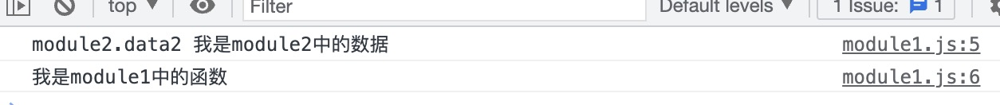
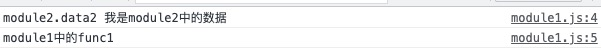
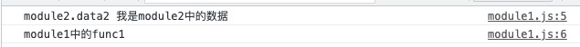
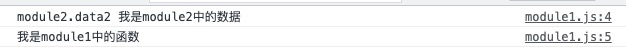

# 一文搞懂前端模块化发展

## 前言

回顾我的代码岁月，总是import xxx from 'xxx'或者const xxx = require('xxx')，却不知为什么要这么写。最近抽空把前端模块化的发展整理一下。接下来，让我们一起走进前端的历史，看看模块化的发展。

github仓库地址：<https://github.com/mengliuliu/module_develop>

## IIFE（Immediately Invoked Function Expression）

文件结构如下

```text
├── IIFE
│   ├── images
│   │   └── result.jpeg
│   ├── index.html
│   ├── index.js
│   └── js
│       └── modules
│           ├── module1.js
│           └── module2.js
```

代码内容如下

```javascript
<!DOCTYPE html>
<html lang="en">
  <head>
    <meta charset="UTF-8" />
    <meta http-equiv="X-UA-Compatible" content="IE=edge" />
    <meta name="viewport" content="width=device-width, initial-scale=1.0" />
    <title>Document</title>
  </head>
  <body>
    <script src="./js/modules/module2.js"></script>
    <script src="./js/modules/module1.js"></script>
    <script src="./index.js">
    </script>
  </body>
</html>


// index.js
module1.func1()


// module1.js
;(function (m2) {
  // 模块中的方法
  const func1 = () => {
    console.log("module2.data2", m2.data2)
    console.log("我是module1中的函数")
  }
  // 暴露的模块
  window.module1 = { func1 }
})(module2)


// module2.js
;(function () {
  // 模块中的数据
  const data2 = "我是module2中的数据"
  // 暴露的模块
  window.module2 = { data2 }
})()
```

执行结果如下


### IIFE分析

上面代码中定义了两个模块，分别为module1、module2。module1依赖module2，并且每个模块的导出对象都挂载在window上。如果module1依赖module2，那么module2必须在module1之前引入。都说了这么多了，相信各位大佬们应该知道IIFE有哪些弊端了吧。

### IIFE总结

- 模块的引入必须按照特定的先后顺序，导致模块不好复用
- 模块的名字容易命名冲突，导致意想不到的结果
- 请求次数过多，有多少个模块就要发送多少次请求（这个问题在出现了打包工具才得已解决）

## CommonJS

文件结构如下

```text
├── CommonJS
│   ├── images
│   │   └── result.jpeg
│   ├── index.js
│   └── js
│       └── modules
│           ├── module1.js
│           └── module2.js
```

代码内容如下

```javascript
// index.js
const module1 = require("./js/modules/module1")
module1.func1()


// module1.js
const module2 = require("./module2")

const func1 = () => {
  console.log("module2.data2", module2.data2)
  console.log("module1中的func1")
}

module.exports = {
  func1,
}


// module2.js
exports.data2 = "我是module2中的数据"
```

执行结果如下


### CommonJS分析

1. 导出

    CommonJS模块通过module.exports或exports导出模块。module是个对象，代表当前模块，module对象有个属性叫exports，并且模块内有个变量叫exports指向modules.exports。换句话说就是模块内部有一条类似于这样的代码var exports = module.exports。

2. 导入

    CommonJS模块通过require导入模块。注意这一切都集成在node中了，只要你使用的require加载模块，被加载的文件就被默认为CommonJS模块。其实require一个模块主要做了两件事，一是执行这个文件，二是得到这个文件的导出对象。

3. 注意

    CommonJS是运行时同步加载，这里说明一下。由于js是解释型语言，所以代码需要先解释在运行，对于解释你暂且把它理解成编译吧。例如var n = 10，就是执行到这行代码，js引擎线程会告诉计算机这行代码需要在计算机内部开辟一部分内存啥啥的，然后再去运行，比如给刚刚声明的变量赋值（往刚刚开辟的内存区域存放一个值）。

### CommonJS总结

- CommonJS解决了命名冲突，模块不好复用等问题
- 运行时同步加载不适合浏览器环境。由于Node.js主要用于服务器编程，模块文件一般都已经存在于本地硬盘，所以加载起来比较快

## RequireJS & AMD（Asynchronous Module Definition）

文件结构如下

```text
├── AMD
│   ├── images
│   │   └── result.jpeg
│   ├── index.html
│   ├── index.js
│   └── js
│       ├── lib
│       │   └── require.js
│       └── modules
│           ├── module1.js
│           └── module2.js
```

代码内容如下

```javascript
<!DOCTYPE html>
<html lang="en">
<head>
    <meta charset="UTF-8">
    <meta http-equiv="X-UA-Compatible" content="IE=edge">
    <meta name="viewport" content="width=device-width, initial-scale=1.0">
    <title>Document</title>
</head>
<body>
    <script data-main="./index.js" src="./js/lib/require.js"></script>
</body>
</html>


// index.js
;(function () {
  require.config({
    // baseUrl: "js/", //基本路径 出发点在根目录下
    // paths: { //  映射: 模块标识名: 路径
      
    // },
  })
  require(["./js/modules/module1.js"], function (module1) {
    module1.func1()
  })
})()


// module1.js
define(["./module2.js"], function (module2) {
  const func1 = () => {
    console.log("module2.data2", module2.data2)
    console.log("module1中的func1")
  }
  return { func1 } // 暴露模块
})


// module2.js
define(function () {
  const data2 = "我是module2中的数据"
  return { data2 }
})
```

执行结果如下


### AMD分析

1. 导出
  AMD模块通过define函数导出模块，函数的参数是个回掉函数，回掉函数的返回值是需要导出的内容。define函数当你引入require.js文件时就已经全局定义了。

2. 导入
  AMD模块通过require函数导入模块，函数的第一个参数是个数组，表示需要导入模块的路径，当然也可以在入口文件中定义映射关系。第二个参数是回掉函数，回掉函数的参数代表导入的模块，在回掉函数中就可以使用导入的模块了。

### AMD总结

由于CommonJS模块是运行时同步加载只适合node环境，AMD是运行时异步加载，正好适合浏览器环境。

## SeaJS & CMD（Common Module Definition）

文件结构如下

```text
├── CMD
│   ├── images
│   │   └── reqult.jpeg
│   ├── index.html
│   ├── index.js
│   └── js
│       ├── lib
│       │   └── Sea.js
│       └── modules
│           ├── module1.js
│           └── module2.js
```

代码内容如下

```javascript
<!DOCTYPE html>
<html lang="en">
<head>
    <meta charset="UTF-8">
    <meta http-equiv="X-UA-Compatible" content="IE=edge">
    <meta name="viewport" content="width=device-width, initial-scale=1.0">
    <title>Document</title>
</head>
<body>
    <script src="./js/lib/Sea.js"></script>
    <script >
        seajs.use('./index.js')
    </script>
</body>
</html>


// index.js
define(function (require) {
  var m1 = require('./js/modules/module1')
  m1.func1()
})


// module1.js
define(function (require, exports, module) {
  const module2 = require('./module2')
  const func1 = () => {
    console.log("module2.data2", module2.data2)
    console.log("module1中的func1")
  }
  exports.func1 = func1
})


// module2.js
define(function (require, exports, module) {
  const data2 = "我是module2中的数据"
  exports.data2 = data2
})
```

执行结果如下


### CMD分析

1. 导入、导出
  AMD模块通过define函数定义模块，函数的参数是个回掉函数。回掉函数有三个参数，分别是require、exports、module。require参数是个函数，用于引入模块；exports参数是一个对象，表示需要导出的内容；module参数是一个对象，表示当前模块。

### CMD总结

看的出来CMD和AMD模块写法很相似，都是用于浏览器端。它两的主要区别是，AMD模块依赖前置，就是把当前的模块所依赖的模块都放在define函数的第一个参数中，这样一眼就可以看出当前模块依赖了哪些模块；CMD模块是就近依赖，把当前模块所依赖的模块放在函数中，什么时候需要就什么时候引入。具体喜欢那种模块，看个人喜好吧。

## UMD

代码内容如下

```javascript
// UMD简单实现
;((global, factory) => {
  //如果 当前的上下文有define函数，并且AMD  说明处于AMD 环境下
  if (typeof define === "function" && define.amd) {
    define(["./module1.js"], factory)
  } else if (typeof exports === "object") {
    //commonjs
    let module1 = require("./module1.js")
    module.exports = factory(module1)
  } else {
    global.module1 = factory(global.moduleA) //直接挂载成 windows 全局变量
  }
})(this, (module1) => {
  module1.func1()
  //本模块的定义
  return {}
})
```

### UMD总结

UMD模块我只贴了一段代码，相信小伙伴们看一遍也明白了。心中是不是在想UMD模块，就这。哈哈哈，就是这样，通过判断语句，把AMD模块和CommonJS模块结合在一起，这样就既可以在浏览器环境运行，也可以在node环境运行。

## ES6Module

文件结构如下

```text
├── ES6Module
│   ├── images
│   │   └── result.jpeg
│   ├── index.html
│   ├── index.js
│   └── js
│       └── modules
│           ├── module1.js
│           └── module2.js
```

代码内容如下

```javascript
<!DOCTYPE html>
<html lang="en">
<head>
    <meta charset="UTF-8">
    <meta http-equiv="X-UA-Compatible" content="IE=edge">
    <meta name="viewport" content="width=device-width, initial-scale=1.0">
    <title>Document</title>
</head>
<body>
    <script type="module" src="./index.js"></script>
</body>
</html>


// index.js
import { func1 } from "./js/modules/module1.js"
func1()


// module1.js
import data2 from "./module2.js"
const func1 = () => {
  console.log("module2.data2", data2)
  console.log("我是module1中的函数")
}
export { func1 }


// module2.js
const data2 = "我是module2中的数据"
export default data2
```

执行结果如下


### ES6Module分析

1. 导出
  ES6Module有两种导出方式，一种是默认导出（export default data2），一种是按需导出（export { func1 }）。
  
2. 导入
  对于默认导出，我们用这样的语句导入模块（import data2 from "./module2.js"），对于按需导出，我们用这样的语句导入模块（import { func1 } from "./js/modules/module1.js"）。当然，一个模块可以同时使用两种导出方式，但是默认导出在一个模块内只能使用一次。

3. 其它
  对于导入，ES6Module还有两种方式，一种是import 'xxx'，只有import没有from。这种语句一般用于加载样式文件，因为这种语句只是执行模块内的代码。另一种是import ('xxx')，这种语句用于动态加载，就是常说的代码分割、路由懒加载啥的，感兴趣的小伙伴可以自行查找资料。你可以理解为当用到这个模块时才会发送请求加载这个模块，这样大大减轻了初始加载js文件过大的问题。

### ES6Module总结

1. ES6Module和CommonJS区别
   - CommonJS模块输出的是一个值的复制，ES6Module输出的是值的引用
   - CommonJS模块是运行时同步加载，ES6Module是编译时加载

2. ES6Module注意事项
   - 由于ES6Module是编译时加载，所以不能讲import语句放在需要运行的代码中，比如if分支、函数内等。因为分支结构内的代码是在运行时执行的，import语句是在代码编译或者说解释时执行的
   - import语句是编译时加载，import函数是运行时异步加载。这里import 'xxx' from 'xxx'和import 'xxx'称为import语句；import('xxx')称为import函数

3. 总结
ES6Module是编译时加载，也就是说在编译时就已经加载了模块，得到了模块导出的内容。大家想一想，编译时，代码还没运行，那么我们得到的一定是值的引用。import函数是运行时异步加载，这使ES6Module既可以在node环境中运行，也可以在浏览器环境中运行，简直太棒了。

## 参考资料

- <https://juejin.cn/post/6844903744518389768>
- <https://juejin.cn/post/6938581764432461854>
- ES6标准入门（第3版）阮一峰著
